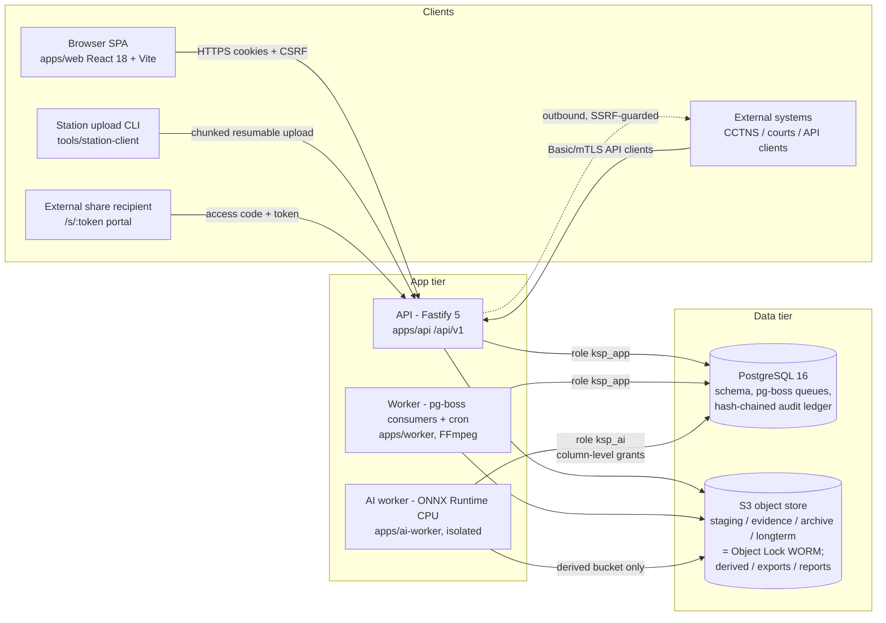
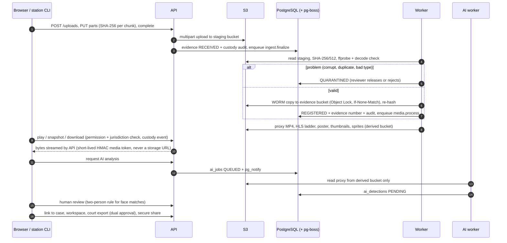

# Architecture

System-level overview of the KSP Video Evidence Management System. Detailed per-area design lives in the
linked documents; binding conventions are in [CONTRACTS.md](CONTRACTS.md). Status markers follow the project
rule: anything not actually run is **UNVERIFIED**.

## 1. Components

| Component | Code | Responsibilities | Details |
|---|---|---|---|
| Shared contracts | `packages/shared` | permissions + default roles, audit action codes, queue names/payloads, settings, enums | [AUTHORIZATION.md](AUTHORIZATION.md) |
| Core platform | `packages/core` | config, Kysely DB + generated types, migration runner, storage (S3, Object Lock), pg-boss, audit writer, FFmpeg wrappers, signer, custody/PDF, ingest pipeline, seed | [CONTRACTS.md](CONTRACTS.md) |
| API | `apps/api/src/modules/*` (29 auto-mounted modules) | authentication, RBAC + jurisdiction, all REST resources, tokenised media streaming, share portal, integration API, metrics | [AUTHENTICATION.md](AUTHENTICATION.md) |
| Worker | `apps/worker/src/jobs/*` (10 job modules) | ingest finalize, media processing, lifecycle (tiering, retention, disposal, fixity), exports, reports, alerts, storage snapshots, audit checkpoints, share watermarking/expiry, AI training export | [VIDEO-PIPELINE.md](VIDEO-PIPELINE.md), [EVIDENCE-LIFECYCLE.md](EVIDENCE-LIFECYCLE.md) |
| AI worker | `apps/ai-worker` | object/person/face detection, face recognition vs watchlists, ANPR, colour, rule-based tagging; results are always PENDING human review | [AI-ARCHITECTURE.md](AI-ARCHITECTURE.md) |
| Web | `apps/web/src/modules/*` (17 modules) | role-aware SPA; evidence tabs/actions contributed by modules | [UI-GUIDELINES.md](UI-GUIDELINES.md), [USER-GUIDE.md](USER-GUIDE.md) |
| Station client | `tools/station-client` | bulk/resumable uploads from police stations | [INGESTION.md](INGESTION.md) |
| Database | `db/migrations` (18 migrations) | schema, `evidence_guard` + jurisdiction triggers, append-only audit ledger with hash chain, least-privilege roles | [AUDIT.md](AUDIT.md) |
| Deployment | `deploy/` | Dockerfile (5 targets), compose, kustomize (staging/production), monitoring, S3 IAM policies — **UNVERIFIED at runtime** | [DEPLOYMENT.md](DEPLOYMENT.md), [INFRASTRUCTURE.md](INFRASTRUCTURE.md) |

## 2. Evidence data flow

## 3. Cross-cutting controls

* **Authorization** — permission codes (`packages/shared/src/permissions.ts`) granted per role at an org unit and
  applying to its ltree subtree. Evidence queries use `evidenceVisibleSql` / `loadEvidenceFor`; out-of-scope
  resources answer 404. See [AUTHORIZATION.md](AUTHORIZATION.md).
* **Integrity** — originals are written once to Object Lock buckets; SHA-256 + SHA-512 recorded at registration;
  scheduled + on-demand fixity; DB trigger forbids changes to immutable columns and deletes. See
  [STORAGE.md](STORAGE.md), [EVIDENCE-LIFECYCLE.md](EVIDENCE-LIFECYCLE.md).
* **Audit / custody** — every evidence touch appends to `audit_events` (append-only, hash chain, signed hourly
  checkpoints); per-item custody verification and signed custody PDF. See [AUDIT.md](AUDIT.md),
  [CHAIN-OF-CUSTODY.md](CHAIN-OF-CUSTODY.md).
* **Separation of duties** — requester ≠ approver for disposals and court exports (API + DB CHECK constraints);
  conflicting permission pairs cannot be combined in one role.
* **AI isolation** — separate process and DB role with column-level grants and a guard trigger; it can read only
  the proxy derivative and cannot write review decisions.
* **Queues** — pg-boss inside PostgreSQL (no separate broker); idempotent handlers; dead-letter queues.

## 4. Deployment topology

Target topology (Kubernetes, CloudNativePG, S3 with Object Lock, DR site with replicated buckets) is described
in [INFRASTRUCTURE.md](INFRASTRUCTURE.md). Only the application processes have been run (on a single development
host, without Docker); container images, compose and Kubernetes are **UNVERIFIED**. Backup/DR:
[BACKUP-RESTORE-RUNBOOK.md](BACKUP-RESTORE-RUNBOOK.md), [DISASTER-RECOVERY.md](DISASTER-RECOVERY.md).
