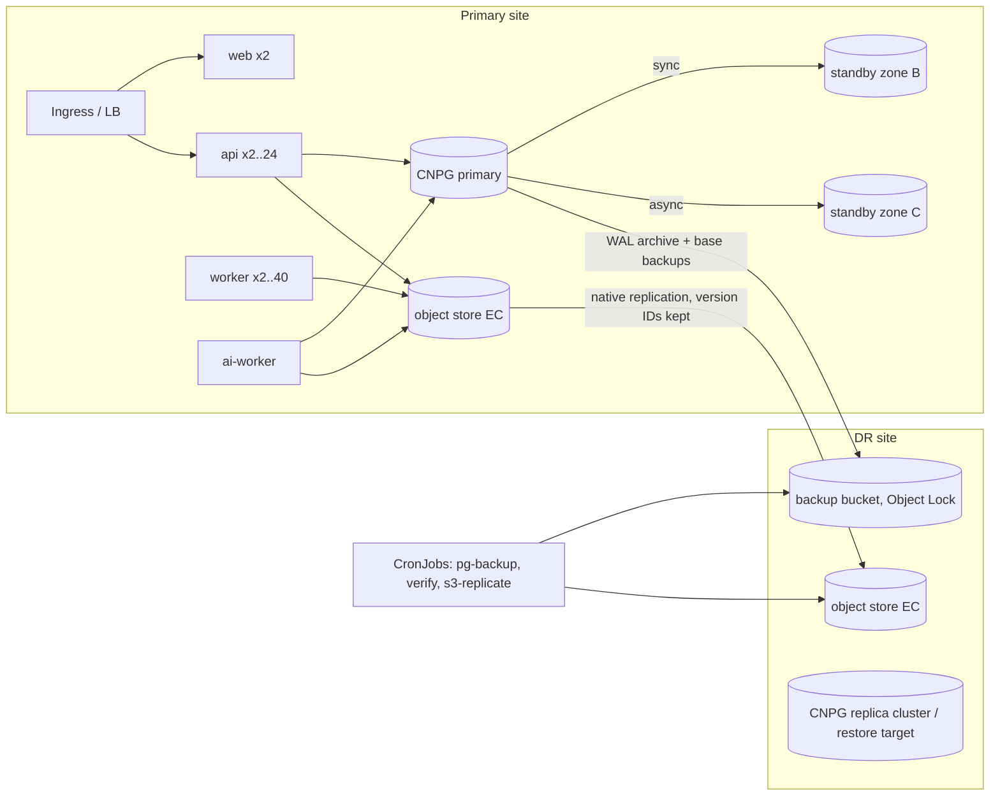

# Disaster recovery, high availability and fault tolerance

Spec targets: encrypted backups, HA, fault tolerance, DR, **critical service restoration ≤ 2 hours**, 99.5 %
availability. What has actually been demonstrated is listed under *Evidence*; everything else is a design and is
marked **UNVERIFIED**.

## 1. What must survive

| Component | State | Protection | RPO (design) | RTO (design) |
|---|---|---|---|---|
| PostgreSQL (metadata, custody ledger, users, cases, queue) | the system of record | CloudNativePG 3 instances over 3 zones, **synchronous** standby (`dataDurability: required`) · continuous WAL archive + weekly base backup to the DR site (PITR) · nightly age-encrypted `pg_dump` in an Object-Lock bucket at the DR site · weekly automated restore verification | 0 for committed transactions (sync replica); ≤ 5 min WAL archive lag for site loss; ≤ 24 h from logical dumps | failover ≈ 30–60 s (automatic); PITR/logical restore: size-dependent (§4) |
| Evidence originals (`evidence`, `archive`, `longterm` buckets) | WORM, versioned, Object Lock | erasure-coded object store (MinIO/Ceph/StorageGRID, ≥ EC 8+4) · **native** bucket/site replication to the DR site (preserves version IDs) · `s3-replicate.ts` as store-agnostic fallback + independent SHA-256 verifier against `evidence.sha256` | replication lag (minutes); 0 lost bytes for acknowledged uploads once replicated | DNS/endpoint switch; no data copy needed |
| Derived media, exports, reports | reproducible from originals (derived) / regenerable (reports) | same replication; derived can be rebuilt by reprocessing | minutes | minutes (or reprocess) |
| Queue (pg-boss) | inside PostgreSQL | same as DB; handlers idempotent, retried | = DB | = DB |
| Secrets / keys | secrets manager (Vault/ASM) | its own HA + backup; age **identity** kept offline (sealed) | n/a | minutes |
| API, worker, AI worker, web | stateless | ≥ 2 replicas, PDBs, zone spread, HPA | n/a | seconds (reschedule) |

Stateless tiers keep nothing locally except scratch (`/work`); a killed worker's job is retried by pg-boss.

## 2. Architecture

## 3. Procedures

Full step-by-step: [BACKUP-RESTORE-RUNBOOK.md](BACKUP-RESTORE-RUNBOOK.md). Summary of a **site loss**:

1. Declare the incident, freeze changes, confirm the primary is really gone (avoid split brain: fence it).
2. DR database: promote the CNPG replica cluster at the DR site **or** `scripts/backup/restore.sh` (logical) /
   CNPG `bootstrap.recovery` (PITR) into a fresh cluster.
3. Object storage: point `S3_ENDPOINT` at the DR store (same bucket names). If copies came from
   `s3-replicate.ts` (not native replication) run `s3-replicate.ts --repoint [--trust-marker]` — version IDs
   differ between stores and the API reads originals by version.
4. `migrate` Job, `ensure-buckets.mjs`, start workloads, `/health/ready`, smoke test (login, evidence, playback,
   fixity), `audit_verify()`, then open to users. Record the restore in the incident register.

### Disposal reaches the DR store (OPS-5)
`s3-replicate.ts` records every DR copy of an evidence original or evidence-keyed derivative
(`evidence/<id>/…`) in `dr_object_copies` (DR bucket, key, **DR version id**, hash) — including copies it finds already
replicated, so a normal run back-fills the registry. After an authorised disposal on the primary, the
**`dr.dispose-sweep`** cron (03:30 daily; CLI `npm run -w @ksp/worker dr:dispose-sweep`) deletes each recorded DR
version of every DISPOSED item with `BypassGovernanceRetention` (disable with `DR_S3_BYPASS_GOVERNANCE=false`):
success → `DELETED` + custody event `EVIDENCE_DR_COPY_DELETED`; a refusal (COMPLIANCE lock, missing
`s3:BypassGovernanceRetention` / `s3:DeleteObjectVersion`, store down) → `DELETE_FAILED` with the error, `attempts`,
custody event `EVIDENCE_DR_COPY_DELETE_FAILED` (outcome FAILURE), retried by later sweeps (max 20 attempts). The worker
needs `DR_S3_ENDPOINT/ACCESS_KEY/SECRET_KEY` (a delete-capable DR identity — not the write-only replication identity);
without them the cron is a no-op. Native store replication (AWS/MinIO/Ceph) must instead be configured to replicate
deletes of versions, or these copies must be swept the same way — **UNVERIFIED** on those stores. Tested with two
bucket sets on the local gateway (`apps/worker/test/dr.test.ts`: real replication script, real disposal, sweep with and
without governance bypass).

## 4. Evidence — DR drill executed on the development host

`tests/dr/drill.sh` (exit 0 on 2026-09-25): real API + worker from the **production image layout**
(`npm ci --omit=dev`, `node dist/...`, `NODE_ENV=production`), real PostgreSQL 16, two independent S3 gateways
(primary + DR), station-client uploads of FFmpeg-generated video, age-encrypted backup, replication, verification,
**database dropped**, restore, repoint, services restarted against the restored DB + DR store, then login, evidence
list/detail/playback, **on-demand fixity of every original executed by the worker against the DR copy**,
`s3-replicate --verify-only`, `audit_verify()`.

Data volume: **5 evidence videos (20 s, 640x360), originals 9.7 MB, derivatives 19.8 MB, database 14.5 MB,
62 audit events before the disaster** (88 after recovery checks). Encrypted dump 348 KB.

| Step | Wall clock |
|---|---|
| provision (migrate + seed, dist entrypoints) | 1.6 s |
| build production image layouts (api + worker) | 3.1 s |
| start api + worker, `/health/ready` | 1.1 s |
| ingest 5 videos (upload → REGISTERED → media READY) | 12.6 s |
| **backup** (pg_dump → age → Object-Lock bucket) | 1.1 s |
| **replicate** 65 objects / 29.5 MB, 5 originals SHA-256 vs DB | 0.7 s |
| **verify backup** (scratch restore, migrations, audit chain, manifest) | 1.7 s |
| disaster (stop services, DROP DATABASE) | 0.1 s |
| **restore database** (fetch, verify, decrypt, pg_restore, checks) | 2.0 s |
| migrate + storage check | 0.5 s |
| repoint 5 originals (full re-hash in DR store, custody events) | 0.3 s |
| start services against DR, `/health/ready` | 1.1 s |
| **restore → service ready (RTO excl. detection/decision)** | **3.9 s** |
| validation incl. 5 worker fixity checks from the DR copy | 9.6 s |
| DR integrity sweep + `audit_verify()` | 0.2 s |

An earlier run with 3 videos (2.3 MB originals) gave 3.5 s restore→ready. **This is a small-data local drill.
The 2-hour restoration target at production scale is UNVERIFIED.**

**Final-audit re-run (2026-09-27, 3 videos, 2.3 MB originals):** the first attempt exposed a drill bug — `start_svc`
backgrounded the whole `cd && setsid …` list, so the recorded pid could be an intermediate shell; the disaster step
then left the *primary* API/worker running and the "DR" readiness check was answered by the stale primary API (the
run only failed because the DR worker could not bind its metrics port). Fixed (`tests/dr/drill.sh` backgrounds only
`setsid` and refuses to continue if the primary ports are still bound). Re-run: **exit 0, restore→service ready
3.4 s**, DR fixity of all 3 originals OK, `audit_verify` 58 events, no break. Earlier drill results were obtained
with the same script, so they may have been affected by the same issue when it occurred; the re-run is the
authoritative local result.

## 5. Estimating RTO at production scale (method)

RTO ≈ detection + decision + infrastructure (DR cluster ready) + **DB restore** + object-store switch +
(repoint) + smoke test.

* **DB restore** — measure on staging with production-sized data: `pg_restore -j N` throughput (typically
  100–300 GB/h on NVMe incl. index builds; index/constraint rebuild dominates) → a 200 GB database ≈ 1–2 h
  logical restore, which alone threatens the 2 h target. Therefore the **primary DR path is a CNPG replica
  cluster at the DR site (promotion in minutes)** or PITR from base backup + WAL (restore time ≈ base backup size
  / network + WAL replay); logical dumps are the last line of defence (corruption / ransomware).
* **Objects** — never copied during recovery: native replication keeps the DR store current and keeps version
  IDs, so no repoint. With `s3-replicate.ts` copies, `--repoint --trust-marker` costs one HEAD per original
  (≈ 1–5 k/s per worker → 10 M originals ≈ 1 h with 4 workers; run in parallel with service start-up since
  playback of not-yet-repointed items fails only for those items). A full re-hash is O(bytes) — at PB scale days —
  and must run afterwards as background fixity, not inside the RTO.
* Record measured values in this table after every quarterly drill on staging.

## 6. Fault tolerance behaviour (design)

* API pod loss: readiness removes it; PDB `minAvailable` keeps ≥ 1 (prod 2); in-flight chunk uploads are
  resumable (client retries the chunk).
* Worker loss mid-transcode: pg-boss job retried (idempotent handlers; derivatives overwritten by key).
* DB primary loss: CNPG promotes the synchronous standby; apps reconnect (pool retries); pg-boss resumes.
* Object store node loss: erasure coding; WORM + versioning protect against deletion/ransomware; Object Lock
  COMPLIANCE is available where legal requirements demand it.
* AI worker loss: analysis jobs re-claimed by the stale-job reaper.

## 7. UNVERIFIED

Docker/Kubernetes execution, CNPG failover, PITR, native MinIO/Ceph/AWS replication, cross-site network
behaviour, restore of a production-sized database, 2-hour RTO, 99.5 % availability.
