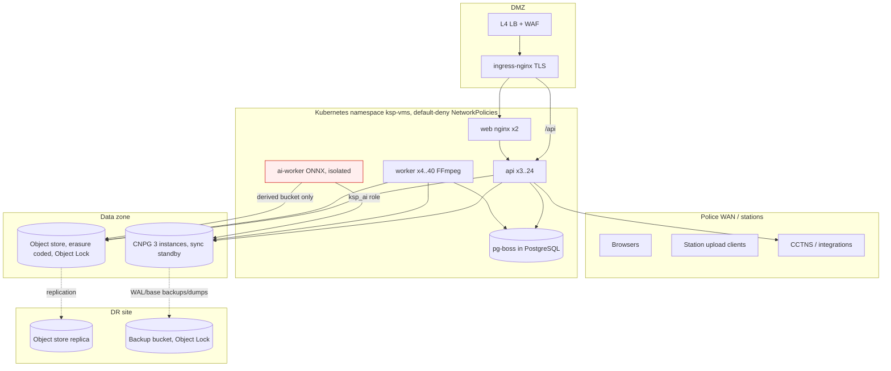

# Infrastructure

## Topology

## Network zones and flows (enforced by `deploy/k8s/base/networkpolicies.yaml`)

| From | To | Port | Why |
|---|---|---|---|
| ingress-nginx | api 4000, web 8080 | TCP | user traffic |
| web | api 4000 | TCP | `/api` proxy |
| api, worker, migrate, backup, ai-worker (label `db-client`) | PostgreSQL 5432 | TCP | data |
| api, worker, migrate, ai-worker (label `s3-client`) | object store CIDR 443/9000 | TCP | objects |
| api, worker | integration CIDR 443 | TCP | CCTNS etc. |
| monitoring ns | api 9464, worker 9465 | TCP | metrics |
| models Job only | internet 443 | TCP | pinned model download |
| backup jobs | DR store CIDR | TCP | backups |
| ai-worker | nothing else (no ingress, no internet) | — | isolation |

## Sizing guidance (starting points — validate with load tests; UNVERIFIED)

Assumptions for a state-wide rollout: ~20 000 body-worn cameras, ~2 h recorded footage per camera-day at ~2 GB/h
(1080p H.264) → **≈ 80 TB/day of originals ≈ 29 PB/year** before retention expiry, plus ~25 % derived (proxy/HLS).

| Tier | Guidance |
|---|---|
| Object store | Erasure-coded (e.g. EC 8+4, 1.5x raw overhead) → ~45 PB raw per retained year at the primary site, the same at DR (or EC with lower overhead / tape-backed long-term tier for `longterm`). Dense JBOD nodes (≥ 24 x 20 TB), 2x100 GbE. Separate pools per tier (`evidence` hot HDD+SSD metadata, `archive`/`longterm` cold). |
| Ingest bandwidth | 80 TB/day ≈ 7.4 Gbit/s average; plan 3x for peaks (shift change) → 25 Gbit/s aggregate into the API/ingest tier. |
| API | Streams uploads/playback: 1 pod ≈ 1–2 Gbit/s; 12–24 pods at peak. 2 vCPU / 2 GiB each. |
| Worker (transcode) | 40 000 h of footage/day. See **Transcoding capacity** below: with libx264 the full ladder needs ≈ 2 600–4 100 4-vCPU workers; `MEDIA_PROFILE=proxy-only` ≈ 720–1 120; `on-demand-hls` adds HLS only for footage that is actually played. Decide `MEDIA_PROFILE` / `MEDIA_ENCODER` (EXT-9). |
| PostgreSQL | Metadata only (≈ 5–20 KB/evidence + audit rows): 10 M items/year ≈ 100–300 GB/year incl. audit. 16–32 vCPU, 64–128 GiB RAM, NVMe, 3 instances. Partition `audit_events` by time when > 1 B rows. |
| AI worker | CPU ≈ 0.3 s/frame for all 6 tasks (dev measurement) → sampling policy decides size; GPU nodes recommended. |

## Transcoding capacity {#transcoding-capacity}

Measured 2026-09-27 with `npm run media:benchmark -w @ksp/worker -- --file <clip> --vcpus 4` (the worker's own FFmpeg
argument builders, CPU = user + sys seconds reported by `ffmpeg -benchmark`), libx264 `veryfast`/CRF 23, 1080p30
source → proxy 1280x720 + HLS 360p/720p/1080p, on the development host (Intel i5-1145G7, 4 cores / 8 threads, laptop
turbo; the host also has ENV-1 hardware instability — re-measure on the production CPU model). Two 5-minute synthetic
clips bracket real body-camera footage: **clean** `testsrc2` (easy to compress) and **noisy** `testsrc2` + strong
temporal noise (hard to compress). No real KSP footage was available.

| Phase | CPU-s per footage-second (clean – noisy) | Wall time for the 5-min clip on 8 threads |
|---|---|---|
| Proxy MP4 (720p) | 1.20 – 1.87 | 65 – 105 s |
| HLS ladder (360/720/1080p, one pass) | 3.18 – 4.99 | 194 – 248 s |
| Poster + thumbnail | 0.001 | < 1 s |
| Sprite sheets | 0.006 – 0.009 | 1 – 2 s |

**4-vCPU workers needed per 1 000 footage-hours/day** (at 70 % sustained utilisation;
workers = CPU-s/footage-s × 3 600 000 / 86 400 / (4 × 0.7)):

| `MEDIA_PROFILE` | CPU-s / footage-s | Workers per 1 000 h/day | At 40 000 h/day (state-wide) |
|---|---|---|---|
| `full` | 4.39 – 6.87 | 65 – 102 | ≈ 2 600 – 4 100 workers (10 500 – 16 400 vCPU) |
| `proxy-only` | 1.21 – 1.88 | 18 – 28 | ≈ 720 – 1 120 workers (2 900 – 4 500 vCPU) |
| `on-demand-hls`, 10 % of footage ever played | 1.53 – 2.38 | 23 – 35 | ≈ 910 – 1 420 workers |
| `on-demand-hls`, 25 % played | 2.00 – 3.13 | 30 – 47 | ≈ 1 190 – 1 860 workers |
| HLS built on play (per played footage-hour) | 3.18 – 4.99 | 47 – 74 per 1 000 played h/day | — |

The earlier estimate of ~1 100 workers for the full ladder (≈1.5x real time per worker) was optimistic by 2–4x.
Hardware encoders (`MEDIA_ENCODER=h264_nvenc|h264_qsv|h264_vaapi`, automatic libx264 fallback) typically move the
encode off the CPU (decode + scaling remain), but **no GPU was available: GPU throughput is UNVERIFIED** — benchmark
with `--encoder h264_nvenc` on the candidate GPU node before sizing. Other levers: a lower proxy resolution or a
2-rung ladder (code change in `plan.ts`), `veryfast`→`superfast` (~30 % less CPU, larger files).

## Environments

`staging` (namespace `ksp-vms-staging`, single zone, 30-day object lock, debug logs) and `production`
(`ksp-vms`, 3 zones, CNPG, External Secrets). Every production change goes through staging (release workflow).
