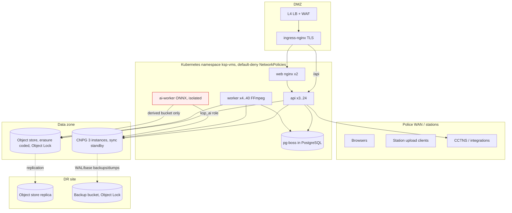

# Infrastructure

## Topology

## Network zones and flows (enforced by `deploy/k8s/base/networkpolicies.yaml`)

| From | To | Port | Why |
|---|---|---|---|
| ingress-nginx | api 4000, web 8080 | TCP | user traffic |
| web | api 4000 | TCP | `/api` proxy |
| api, worker, migrate, backup, ai-worker (label `db-client`) | PostgreSQL 5432 | TCP | data |
| api, worker, migrate, ai-worker (label `s3-client`) | object store CIDR 443/9000 | TCP | objects |
| api, worker | integration CIDR 443 | TCP | CCTNS etc. |
| monitoring ns | api 9464, worker 9465 | TCP | metrics |
| models Job only | internet 443 | TCP | pinned model download |
| backup jobs | DR store CIDR | TCP | backups |
| ai-worker | nothing else (no ingress, no internet) | — | isolation |

## Sizing guidance (starting points — validate with load tests; UNVERIFIED)

Assumptions for a state-wide rollout: ~20 000 body-worn cameras, ~2 h recorded footage per camera-day at ~2 GB/h
(1080p H.264) → **≈ 80 TB/day of originals ≈ 29 PB/year** before retention expiry, plus ~25 % derived (proxy/HLS).

| Tier | Guidance |
|---|---|
| Object store | Erasure-coded (e.g. EC 8+4, 1.5x raw overhead) → ~45 PB raw per retained year at the primary site, the same at DR (or EC with lower overhead / tape-backed long-term tier for `longterm`). Dense JBOD nodes (≥ 24 x 20 TB), 2x100 GbE. Separate pools per tier (`evidence` hot HDD+SSD metadata, `archive`/`longterm` cold). |
| Ingest bandwidth | 80 TB/day ≈ 7.4 Gbit/s average; plan 3x for peaks (shift change) → 25 Gbit/s aggregate into the API/ingest tier. |
| API | Streams uploads/playback: 1 pod ≈ 1–2 Gbit/s; 12–24 pods at peak. 2 vCPU / 2 GiB each. |
| Worker (transcode) | 40 000 h of footage/day ≈ 1 670 footage-hours per hour. At ~1.5x real-time per 4-vCPU worker for proxy + HLS ladder that is ≈ 1 100 workers (4 400 vCPU) — not economical on CPU. A capacity decision is required: proxy-only by default with HLS on demand, GPU/Quick Sync encoding, or a lower ladder (KNOWN-ISSUES). |
| PostgreSQL | Metadata only (≈ 5–20 KB/evidence + audit rows): 10 M items/year ≈ 100–300 GB/year incl. audit. 16–32 vCPU, 64–128 GiB RAM, NVMe, 3 instances. Partition `audit_events` by time when > 1 B rows. |
| AI worker | CPU ≈ 0.3 s/frame for all 6 tasks (dev measurement) → sampling policy decides size; GPU nodes recommended. |

## Environments

`staging` (namespace `ksp-vms-staging`, single zone, 30-day object lock, debug logs) and `production`
(`ksp-vms`, 3 zones, CNPG, External Secrets). Every production change goes through staging (release workflow).
