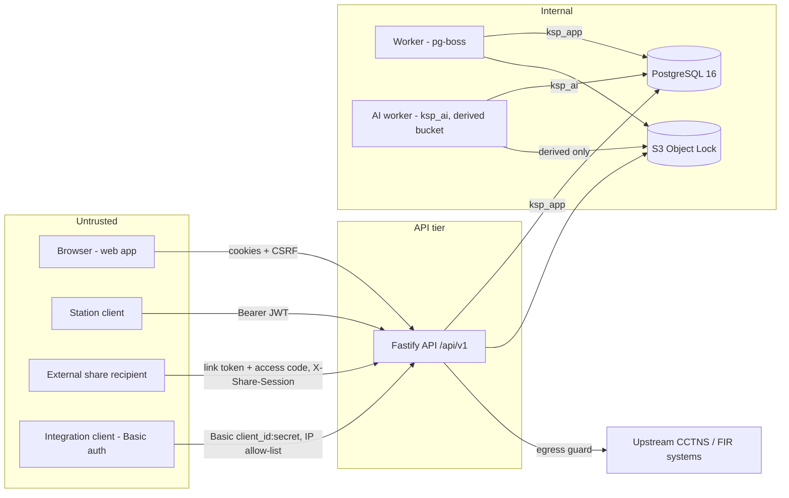

# Threat model (STRIDE)

Scope: KSP Video Evidence Management System — station client, web app, API, worker, AI worker, PostgreSQL,
S3 object storage, external integrations and the external share portal. Written by the internal security testing
workstream; see `docs/SECURITY-TEST-REPORT.md` for what was actually tested. This is **not** a CERT-In VAPT.

## Assets

| Asset | Why it matters | Primary controls |
|---|---|---|
| Original evidence files | Court evidence; must never change or leak | S3 Object Lock + conditional writes (`packages/core/src/storage.ts`), `evidence_guard` trigger, SHA-256/512 at ingest, integrity checks, no storage URLs to clients |
| Chain-of-custody ledger (`audit_events`) | Proves who touched what | Append-only, hash chain + signed checkpoints (`db/migrations/0002_audit_ledger.sql`), INSERT only via `audit_append()`, `audit_verify()` |
| Credentials & keys | Account takeover, token forgery | Argon2id hashes, AES-256-GCM secrets at rest (`packages/core/src/crypto.ts`), EdDSA JWT key, HMAC media key, keys from files/env only |
| PII & biometrics (faces, plates, watchlists) | DPDP / legal exposure | Jurisdiction scoping, AI review workflow, `ksp_ai` column-level grants, legal review pending (KNOWN-ISSUES) |
| Sessions & share links | Delegated access to evidence | Server-side session row checked per request, short TTLs, share access codes, revocation |

## Trust boundaries

Every arrow crossing from *Untrusted* into the API tier carries attacker-controlled input. Uploaded media is
attacker-controlled even after it reaches the internal tier (it is parsed by FFmpeg in the worker and AI worker).

## STRIDE per component

| Component | Threat (STRIDE) | Mitigation (code) | Residual risk |
|---|---|---|---|
| Web app | **T/I** XSS via evidence titles, notes, annotations, alert text | React escaping; no `dangerouslySetInnerHTML`/`innerHTML` in `apps/web/src` (grep); CSP `script-src 'self'` (`apps/api/src/app.ts`) | CSP `style-src 'unsafe-inline'`; no browser E2E XSS test |
| Web app | **S** CSRF | SameSite=Strict cookies + double-submit header + Origin check (`plugins/auth.ts`); every unsafe route swept (`security-routes.test.ts`) | — |
| API authn | **S** credential stuffing, token forgery | Argon2id, lockout + IP throttle, dummy-hash timing, EdDSA-only JWT with typ/iss/aud checks (`lib/session.ts`), refresh rotation + reuse detection; MFA step honours lockout (SEC-11); TOTP single-use per step + atomic recovery-code consumption (SEC-12, migration 0991) | Login timing measured: median difference < 25 % (mean ~15–19 % from the failed-count UPDATE) — `security-auth.test.ts` |
| API authz | **E** IDOR / cross-jurisdiction | `loadEvidenceFor`/`evidenceVisibleSql`/`orgScopeSql`; 404 for out-of-scope; route sweep proves 401 on every non-public route; data-driven IDOR matrix over all 115 id routes (`security-idor.test.ts`); upload officer/device attribution scoped (SEC-13); reprocess scoped (SEC-09) | Relationship-based visibility (cases, shares) is only as good as case membership hygiene |
| API authz | **E** API client escaping integration API | Route prefix check in `plugins/auth.ts`; swept for every route | Prefix check relies on router not normalising `..` (tested) |
| Media endpoints | **I** token reuse / scope escalation | HMAC tokens bound to evidence + scope + ref, session/share/client re-checked (`modules/media/tokens.ts`); non-share tokens with a foreign `ref` refused on `/media/download` (SEC-04) | Tokens are bearer; valid for TTL (60 s–15 min) if leaked |
| Upload pipeline / worker | **T/I/E** crafted media (playlists, concat) making FFmpeg open local files or URLs | `-protocol_whitelist` + `-format_whitelist` (`MEDIA_FORMAT_WHITELIST`, SEC-01) on probe, decode check and transcode inputs | FFmpeg demuxer/decoder memory-safety bugs; run workers sandboxed and patched |
| AI worker | **E/I** compromise reads evidence/users | `ksp_ai` explicit grants only; detection insert guard (job RUNNING); derived bucket only (`security-db-privileges.test.ts`) | Per-service S3 credential isolation UNVERIFIED locally (versitygw single account) |
| PostgreSQL | **T/R** rewriting custody history | REVOKEs + triggers on audit, evidence, integrity, case notes, share log, review events (tested as `ksp_app`) | Superuser/owner can still edit — detected by hash chain, not prevented |
| Object storage | **T** overwrite/delete originals | Object Lock + versioning + `ifNoneMatch` | GOVERNANCE mode can be bypassed by privileged S3 principals |
| Integrations | **I/E** SSRF via `base_url` | `integrations/egress.ts`: scheme allow, private/metadata ranges denied incl. IPv4-compatible IPv6 (SEC-02), connect-time DNS check, no redirects | mTLS path UNVERIFIED; upstream contracts unknown |
| Share portal | **S/I** guessing codes, reaching originals/HLS | Rate-limited open, lockout, domain-separated HMAC session header (not a cookie), SHARE tokens limited to watermarked/proxy media | A locked share cannot be unlocked (usability) |
| Reports | **I** download after session end | Token bound to user/session/run; idle timeout now enforced (SEC-03) | — |
| Secrets at rest | **T** forged ciphertext | AES-256-GCM with 16-byte tag pinned (SEC-05) | Key in env/file, not HSM |
| All | **D** resource exhaustion | Global + per-route rate limits (verified to 429 in a production-configured build, incl. new upload-initiation limit SEC-15), body limits, FFmpeg timeouts, zip inflate/entry/ratio limits on `/exports/verify` (SEC-14), DB connection errors no longer crash the process (SEC-16) | Single-host load figures only (`docs/PERFORMANCE.md`); no distributed-DoS test |
| All | **R** repudiation | Every auth/admin/evidence action audited in the same transaction | — |
